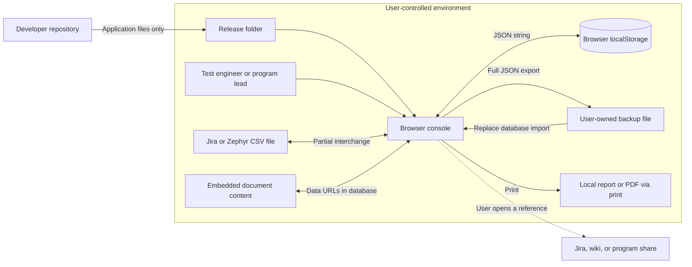
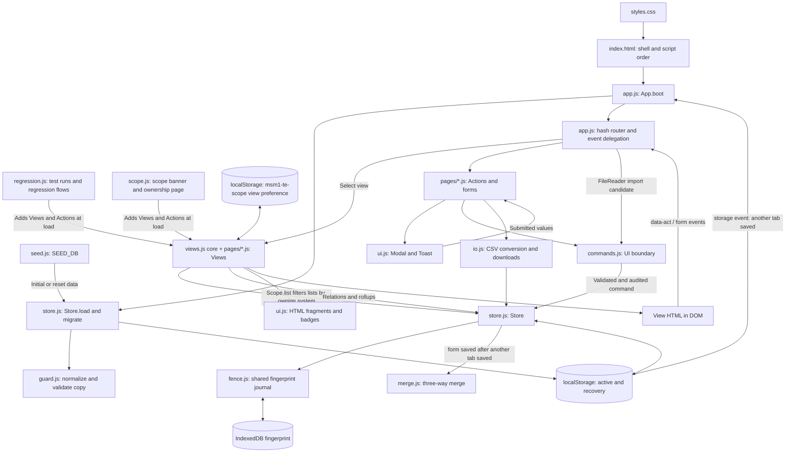
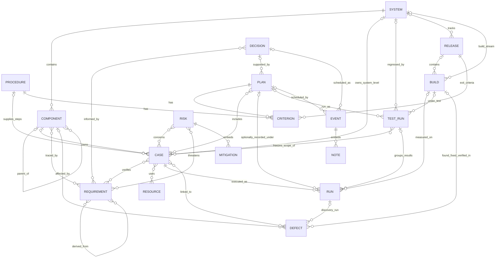
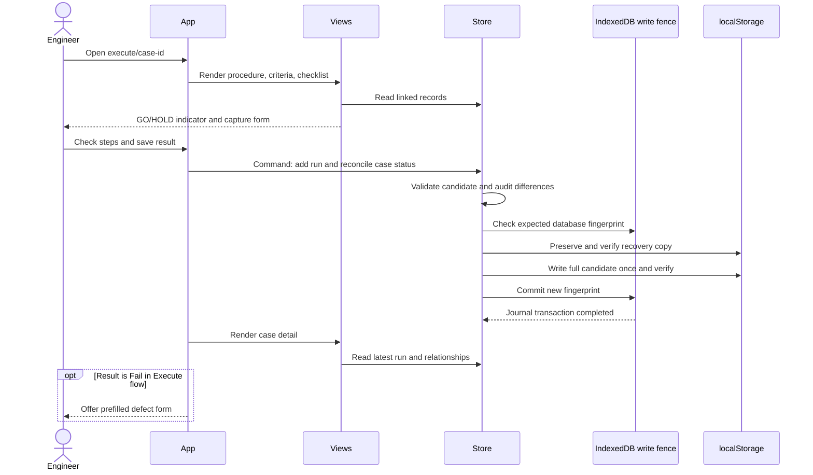
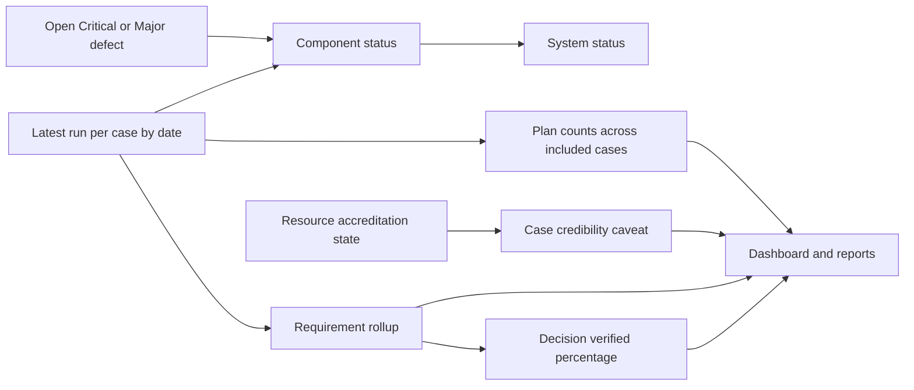
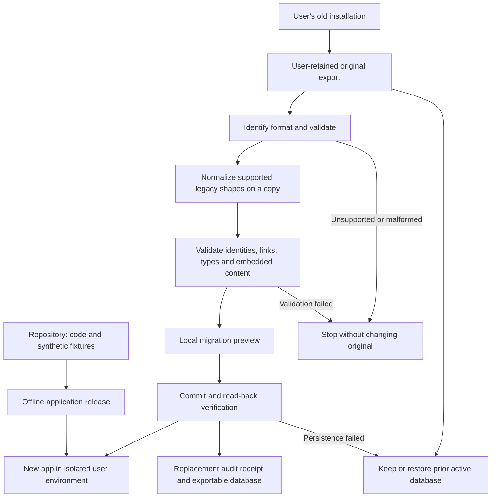

# Architecture drawings — MSM-1 T&E Console

Original baseline: `f9645ca`, updated for the hardening pass. Diagrams 1–4 show the current system. Diagram 5 shows the implemented staged-import path; richer versioned packages remain proposed. Mermaid source is embedded for maintenance and
renders in supporting Markdown viewers; no hosted diagram service is required.

## 1. System context and sensitive-data boundary

No implemented data synchronization path leads from the user environment to the
repository. Browser storage and exported JSON belong to the user. All runtime assets are local and background connections are blocked by the Content Security Policy.
Linked evidence requires separate access; a reference is not a copied file.

## 2. Runtime modules

Several tabs share the one localStorage database. A save in any tab fires a
`storage` event in the others, which catch up in place (`Store.syncFromStorage`) and
redraw. Each save waits inside the Web Lock until the tab sees the last committed
write (`WriteFence.settle`), catches up, then applies its change; a form that opened
before another tab's save is merged three ways (`Merge.db`), and a field both tabs
changed is returned to the form as a conflict to decide.

All scripts share global bindings. This is a conceptual responsibility diagram;
`Load` and `Store` are methods of the same Store object. Actions also use shared UI
helpers and trigger `App.render()`. Full-page HTML regeneration is the main update
mechanism; there is no virtual DOM or backend.

## 3. Logical data relationships

This is the intended logical model; the current store does not enforce all
cardinalities. A case belongs to a component (whose system it inherits) or, with
no component, directly to a system. Components nest through `parentComponentId`;
cycles are rejected. Requirements carry an optional class (System, PSPEC, SW) and
may flow down from parents through `derivedFromIds`; the trace matrix draws one grid
per class. Flow-down never feeds the verification rollup. A test run session stores its frozen case list; each case's
result in it is an ordinary run carrying `testRunId`, so per-case history and
every existing rollup keep working unchanged. Each system has its own releases and
build stream; a run optionally records the build it was measured on (`buildId`).
Builds label results with their age but never change a rollup. Requirements, procedures, plans,
test runs, risks, defects, decisions, events, documents and resources may carry an
owning `systemId`; blank means program-level. Ownership drives only which records
the system scope lists, never relationships or computed status. Each criterion belongs to a procedure **or** a plan through
`parentType` + `parentId`, not both. Many-to-many links use ID arrays, not join
tables. Mitigations and event notes are nested records. Documents use free-text
`relatedCodes`, while evidence references on runs are also text; neither is an
enforced foreign-key relationship. Audit and snapshots sit beside the graph.

## 4. Execution and derived evidence

The run and case change share one active-database write, guarded by Web Locks and the fingerprint journal. UI success is released after verification and journal completion. The two storage engines are not one atomic transaction: a crash between them can require fail-closed recovery, as described in [Hardening](HARDENING.md). Checklist progress is transient and HOLD remains advisory.

Caveats do not currently veto requirement verification or decision percentages.
Plan counts are not filtered by the run's plan. These distinctions explain why
stronger evidence qualification is proposed in the roadmap.

## 5. Release and staged-import architecture

The user's data never needs to reach the developer. Current JSON and CSV imports use staged validation and preview. Richer versioned package manifests and a general historical migration registry remain future work.

Current boundaries: Views → UI commands → Store validation/audit → write fence and localStorage. Migration operates on staged data; evidence payloads remain embedded in the JSON database. No server or cloud
component is needed. [Compatibility contract](DATA-COMPATIBILITY.md) defines the
acceptance tests and rollback requirements.
